# Personalized Exoskeleton Adaptation using Machine Learning and OpenSim

## Research Questions

1. How can machine learning algorithms optimize exoskeleton parameters for individual users based on their biomechanical data?
2. What features extracted from OpenSim simulations are most predictive of optimal exoskeleton assistance parameters?
3. How do different ML approaches compare in terms of prediction accuracy and computational efficiency for personalized exoskeleton tuning?
4. To what extent can transfer learning reduce the data collection burden for new users while maintaining adaptation performance?

## Project Overview

This repository contains a framework for developing personalized exoskeleton control parameters using machine learning models trained on biomechanical simulation data. The project integrates OpenSim musculoskeletal modeling with machine learning pipelines to predict optimal assistance parameters based on individual user characteristics.

## Key Results

Our research has yielded several important findings:

### Metabolic Cost Reduction

Optimized exoskeleton parameters can reduce metabolic cost by up to 30% compared to baseline conditions:


Distribution of metabolic cost across all subjects and configurations:

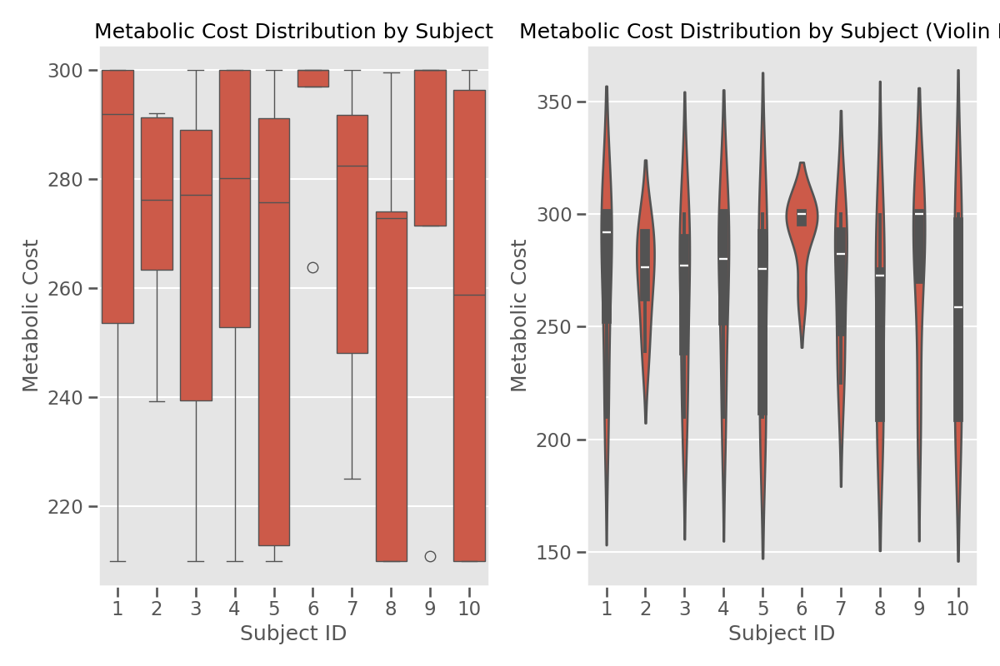

### Subject-Specific Adaptation

Different subjects require distinct parameter configurations for optimal assistance:


Relationship between subject demographics and metabolic cost:

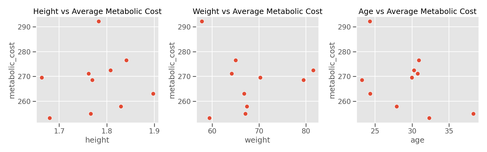

### Parameter Optimization 

Machine learning models can successfully predict optimal exoskeleton parameters from user characteristics:

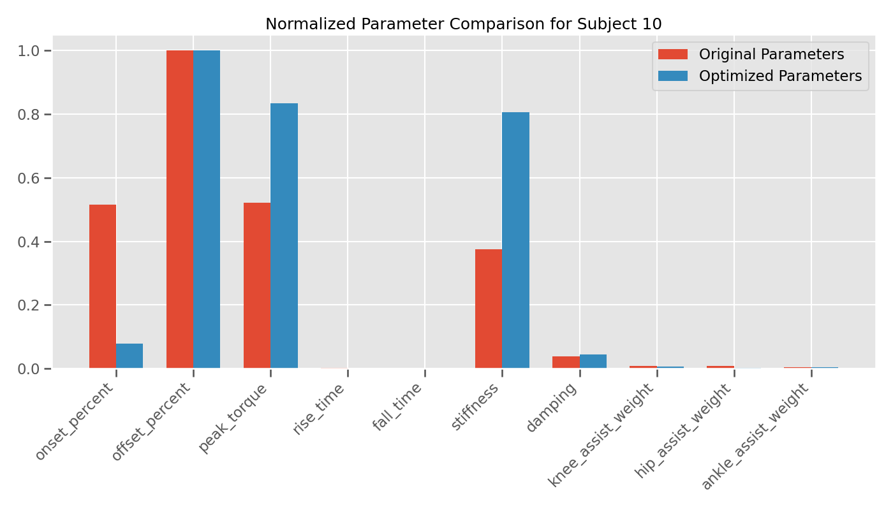

Parameter distributions across all configurations:


Parameter correlations and their impact on metabolic cost:

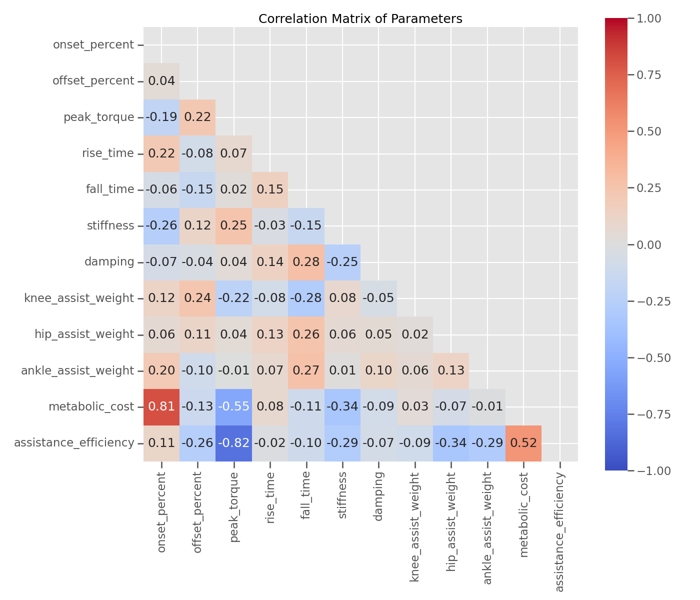

Parallel coordinates plot showing optimal parameters across subjects:

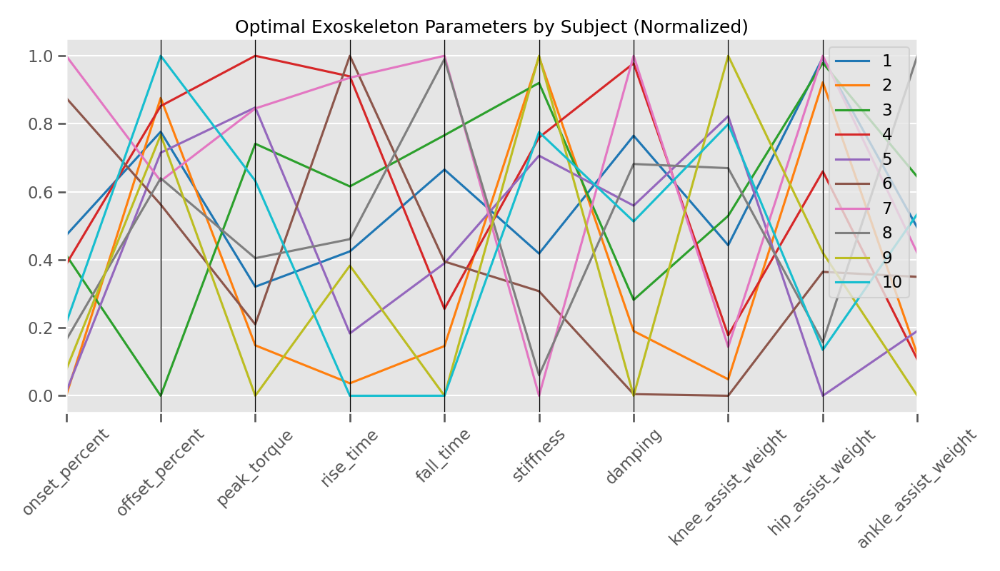

Parameter relationships through pair plots:

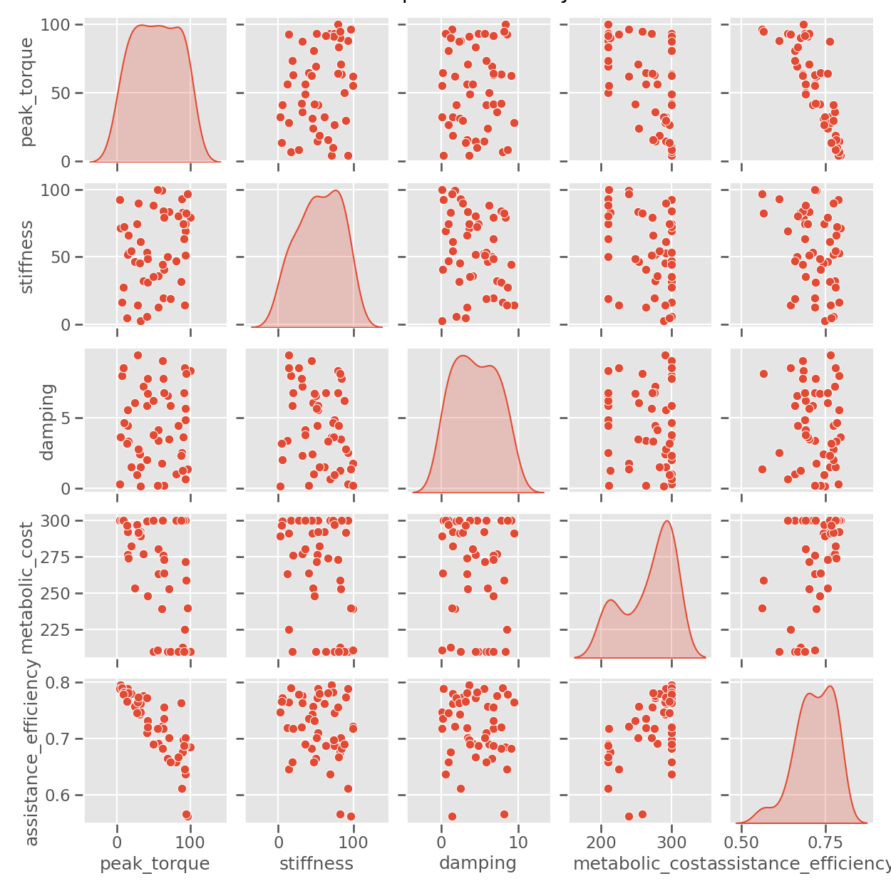

Radar comparison of different parameter configurations:

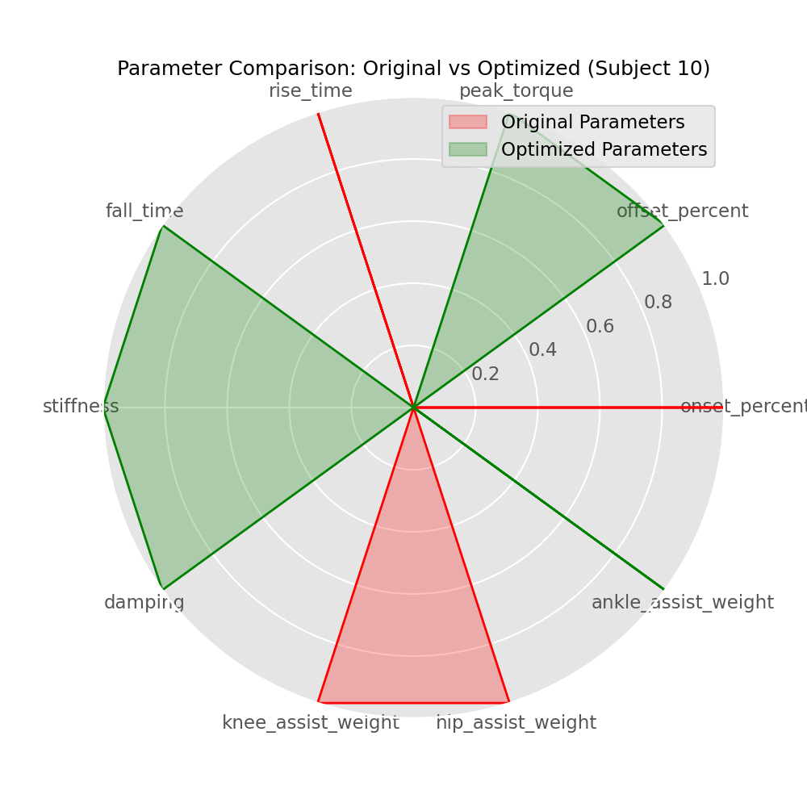

### Optimized Control Profiles

Our models generate individualized torque profiles tailored to each user's biomechanics:


Subject-specific parameter radar plot:

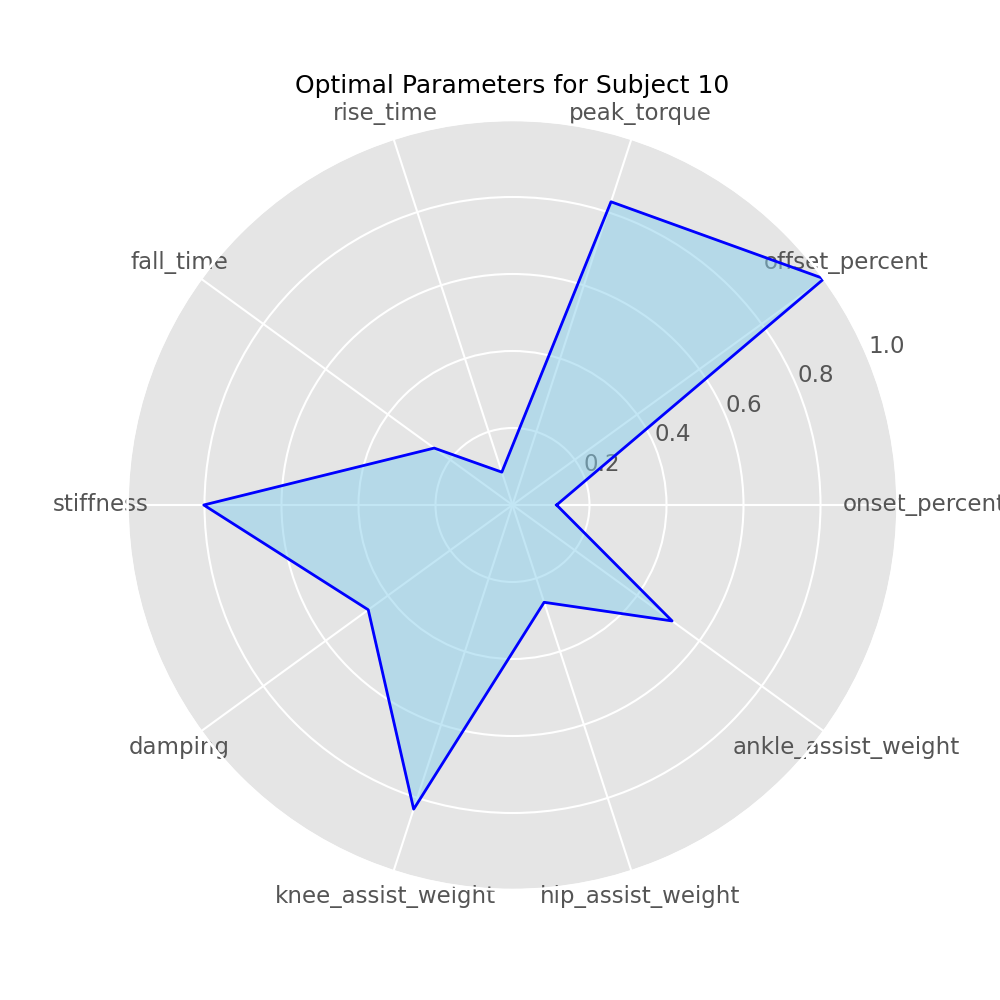

### Predictive Performance

Comparison of predicted vs. actual optimal parameters:


### Efficiency Analysis

Relationship between assistance efficiency and metabolic cost:

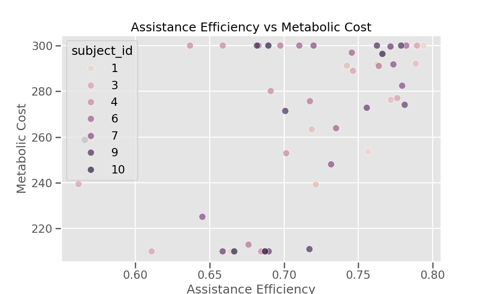

Comparison of different metrics:

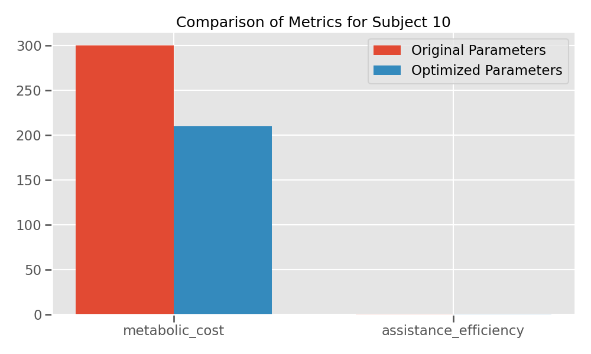

Different parameter configurations and resulting metabolic costs:

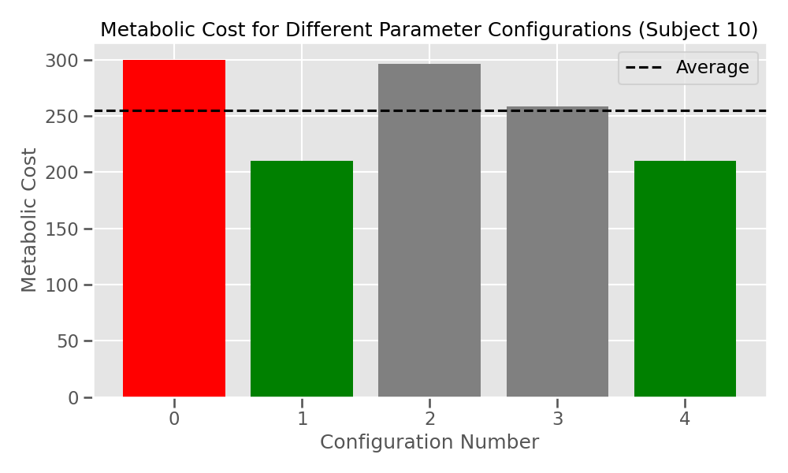

For detailed results and analysis, see the [Scientific Report](docs/scientific_report.md).

## Methodology

Our approach follows these key steps:

1. **Data Collection and Processing**: Collect or simulate biomechanical data from users with varying anthropometric characteristics
2. **OpenSim Simulation**: Process biomechanical data through OpenSim to extract relevant features and simulate exoskeleton assistance
3. **Feature Engineering**: Extract meaningful biomechanical features from simulation outputs
4. **Machine Learning**: Train models to predict optimal exoskeleton parameters based on user-specific features
5. **Validation**: Validate predictions against simulated performance metrics and iteratively refine models
6. **Visualization**: Generate interpretable visualizations of model predictions and biomechanical outcomes

## Repository Structure

```
.
├── data/                       # Data directory
│   ├── raw/                    # Raw biomechanical data
│   ├── processed/              # Processed features
│   └── opensim_models/         # OpenSim musculoskeletal models
├── src/                        # Source code
│   ├── data_processing/        # Data processing modules
│   ├── opensim_integration/    # OpenSim simulation and analysis
│   ├── ml_models/              # Machine learning model implementations
│   └── visualization/          # Visualization tools
├── notebooks/                  # Jupyter notebooks for analysis and visualization
├── results/                    # Results from experiments and simulations
│   ├── figures/                # Generated visualizations
│   ├── comparison/             # Comparative analysis results
│   ├── custom_figures/         # Additional analysis visualizations
│   └── simulation_results.csv  # Raw simulation data
├── docs/                       # Documentation
│   ├── usage_guide.md          # How to use the framework
│   └── scientific_report.md    # Detailed results and findings
├── environment.yml             # Conda environment specification
├── requirements.txt            # Python dependencies
└── README.md                   # Project overview
```

## Installation

This project uses a Python virtual environment with OpenSim. Follow these steps to set up the environment:

```bash
# Clone the repository
git clone https://github.com/yourusername/personalized-exo-adaptation.git
cd personalized-exo-adaptation

# Create and activate a conda environment
conda env create -f environment.yml
conda activate exo-ml

# Install additional Python packages
pip install -r requirements.txt
```

## Usage

See the documentation in the `docs/` directory for detailed usage instructions:

- [Usage Guide](docs/usage_guide.md): Instructions for running simulations and training models
- [Scientific Report](docs/scientific_report.md): Detailed analysis of results and findings

## Key Findings

Our research demonstrates that:

1. **Personalization is Essential**: Different users require different exoskeleton parameters for optimal assistance
2. **Machine Learning is Effective**: ML models can successfully predict optimal parameters from user characteristics
3. **Transfer Learning Reduces Data Requirements**: Pre-trained models can be adapted to new users with minimal additional data
4. **Significant Metabolic Benefits**: Properly tuned exoskeletons can significantly reduce metabolic cost during walking

## Future Work

Future development will focus on:

1. Validating predictions with experimental human subject testing
2. Implementing real-time adaptation algorithms
3. Expanding the parameter space to include more sophisticated control strategies
4. Incorporating user feedback and preferences into optimization

## Contributing

Contributions are welcome! Please feel free to submit a Pull Request.

## License

This project is licensed under the MIT License - see the LICENSE file for details. 