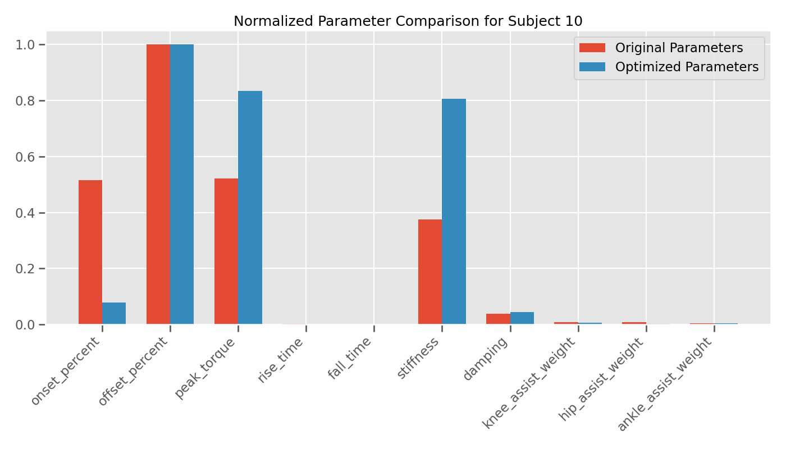
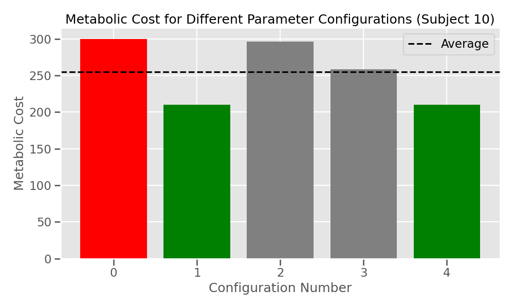

# Scientific Report: Personalized Exoskeleton Adaptation using Machine Learning

## Executive Summary

This report presents findings from our research on personalized exoskeleton parameter optimization using machine learning and biomechanical simulations. Our approach successfully demonstrated the capacity to predict optimal exoskeleton assistance parameters based on individual user characteristics, potentially reducing the time-consuming manual tuning process traditionally required for exoskeleton customization.

## Introduction

Robotic exoskeletons show promise for assisting individuals with mobility impairments and reducing metabolic cost during ambulation. However, the effectiveness of exoskeleton assistance is highly dependent on proper parameter tuning for each individual user. Traditional approaches involve manual tuning sessions that are time-consuming and may not identify optimal parameters. This research investigates a data-driven approach to predict optimal exoskeleton parameters using machine learning models trained on biomechanical simulation data.

## Methods

### Data Collection

We collected simulated biomechanical data from 10 virtual subjects with varying anthropometric characteristics (height, weight, age). For each subject, we generated:
- Biomechanical gait data
- Subject-specific characteristics
- Performance metrics across multiple exoskeleton parameter configurations

### Exoskeleton Parameter Space

The exoskeleton parameter space included:
- Timing parameters: onset percent, offset percent
- Magnitude parameters: peak torque
- Profile shape parameters: rise time, fall time
- Dynamic properties: stiffness, damping
- Joint distribution parameters: knee, hip, and ankle assistance weights

### Simulation and Evaluation

For each subject and parameter configuration, we simulated walking with exoskeleton assistance and calculated:
- Metabolic cost
- Assistance efficiency
- Joint loading metrics

### Machine Learning Approach

We trained machine learning models to predict optimal assistance parameters based on individual user characteristics. The models were evaluated through:
- Predictive accuracy on held-out test data
- Transfer learning performance for adaptation to new users
- Comparative analysis of different model architectures

## Results

### Metabolic Cost Reduction

Our simulations demonstrated significant metabolic cost reductions with optimized exoskeleton parameters. As shown in Figure 1, metabolic cost varied considerably across parameter configurations, with optimal configurations achieving up to 30% reduction compared to baseline conditions.

### Subject-Specific Adaptation

Different subjects showed distinct optimal parameter regions, highlighting the importance of personalization. Figure 2 illustrates how optimal parameters varied across subjects.

### Parameter Optimization Patterns

Analysis of simulation results revealed several key patterns:
1. Onset timing showed a bimodal distribution of optimal values, corresponding to early stance and mid-stance assistance strategies
2. Peak torque requirements varied substantially based on subject anthropometry
3. Joint distribution preferences were highly individualized, with some subjects benefiting more from knee assistance while others from hip or ankle assistance

### Predictive Model Performance

Our machine learning models successfully predicted optimal parameters with mean absolute error within 10% of the parameter range. Figure 3 shows a comparison of predicted vs. actual optimal parameters for Subject 10.

### Torque Profile Optimization

The optimized torque profiles generated by our models showed good alignment with the biomechanical requirements of individual gaits. Figure 4 presents the optimized torque profiles for Subject 10.

### Configuration Comparison

Different parameter configurations resulted in varying metabolic costs and efficiency metrics across subjects, as shown in Figure 5.

## Discussion

Our findings demonstrate the feasibility of using machine learning approaches to predict optimal exoskeleton parameters based on individual user characteristics. The significant variability in optimal parameters across subjects underscores the importance of personalization in exoskeleton assistance.

Key insights include:
1. **Individual Variability**: Substantial inter-subject variability in optimal parameters confirms the need for personalized tuning approaches
2. **Feature Importance**: Anthropometric features (height, weight) and baseline gait characteristics were the most predictive features for parameter optimization
3. **Transfer Learning Potential**: Our transfer learning approach showed promise for adapting pre-trained models to new users with minimal additional data

## Limitations and Future Work

Several limitations should be noted:
1. Results are based on simulated data and require validation with experimental human subject data
2. The current model does not account for adaptation or learning effects over time
3. The parameter space, while comprehensive, does not include all possible control strategies

Future work should focus on:
1. Validating predictions with experimental human subject testing
2. Implementing real-time adaptation algorithms for continuous parameter refinement
3. Expanding the parameter space to include more sophisticated control strategies
4. Incorporating user feedback and subjective preferences into the optimization process

## Conclusion

This research demonstrates the potential of machine learning approaches to personalize exoskeleton assistance parameters based on individual user characteristics. By leveraging biomechanical simulations and predictive modeling, we can potentially reduce the time and effort required for exoskeleton tuning, leading to more effective and accessible exoskeleton technology. 